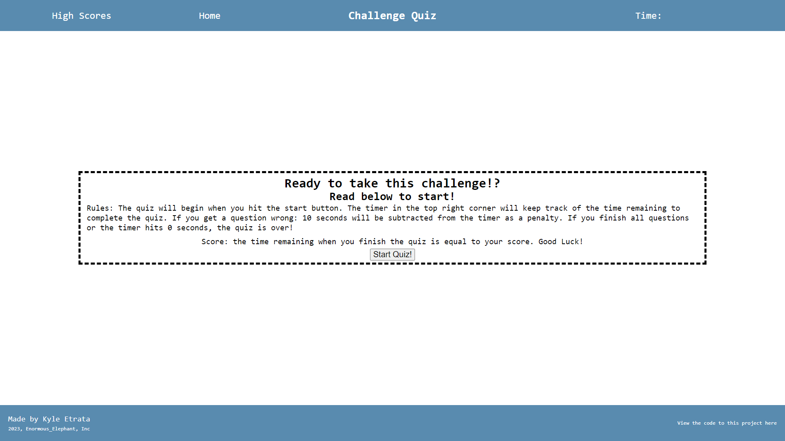
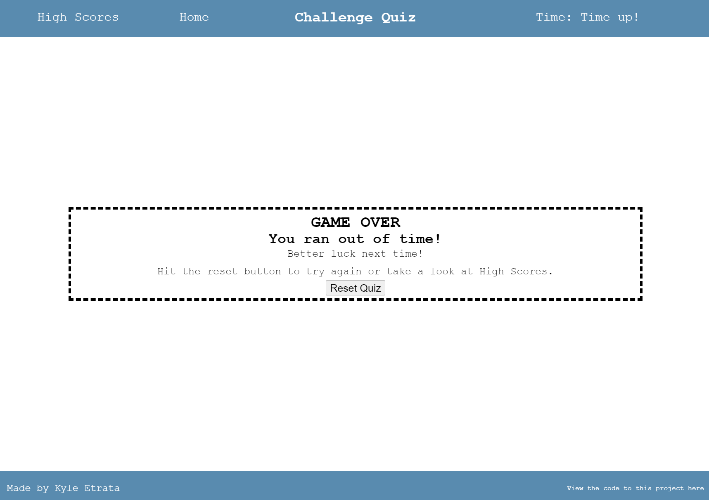
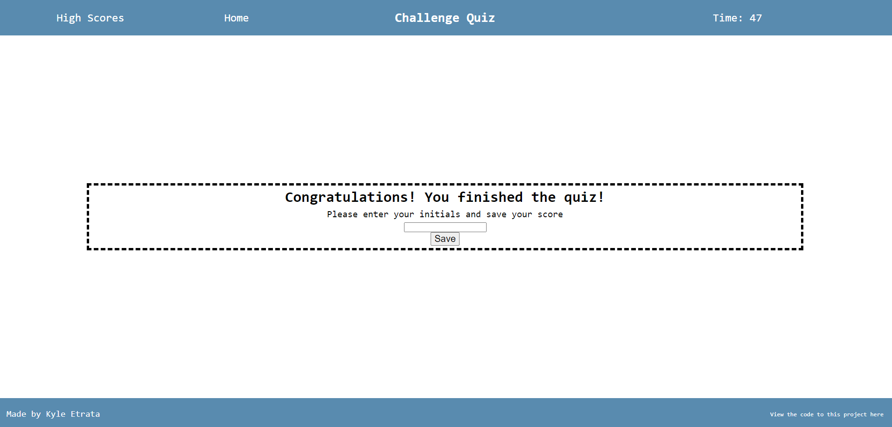
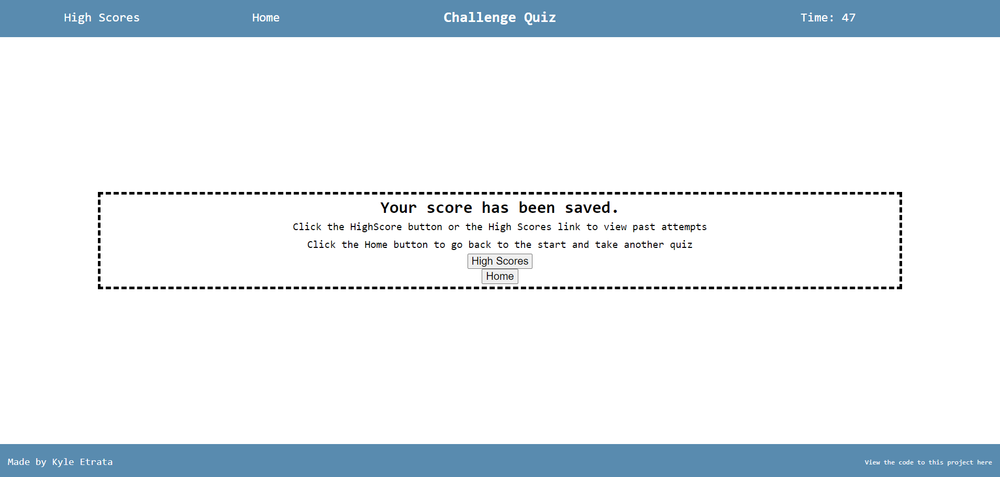
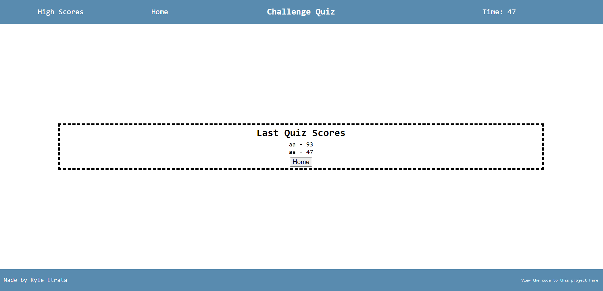

# 04-WebAPIs-Challenge-4

## Description

This project had the goal of building a responsive website that changed the elements of HTML through the use of JavaScript and Web APIs. The quiz created has only a small fraction of HTML code built into it, with the rest of the functionality built through JavaScript. To demonstrate the use and understanding of JavaScript and Web APIs, I have created a quiz. First loading the page, you will be presented with a home page that welcomes the user to the quiz, explaining the rules and how the scoring works. You can return to this quiz by hitting the home text in the top left. Web APIs made it possible to also save completed quizzes scores and initials of the user upon completion. These scores will be displayed in from the oldest score and initial at the top of the list to the most recent attempt on the bottom. When the time reaches 0, the game is over and it will show a screen with 'Game Over!' and have a button to redirect you back to the home page. There have been screenshots added below to show what to expect in each scenario. 

The problems that this project seeks to aim are the usage and finesse of both JavaScript and Web APIs to create dynamic websites without having to use anchor tags in the HTML to redirect users to a separate deployed HTML file. This can be beneficial, for users who find that loading times can be long when having their location be deployed to yet another HTML file.

A challenge faced during this project was working with creating a dynamic website. The DOM objects and DOM arrays were difficult to identify when declaring a variable in JavaScript and setting it's value to a querySelector(). Without know what data-type the variable was being set as, it was challenging to know what methods would work on the data-type without console.log in order to clarify the data-type. In the future, more work will be needed to swiftly identify the types of DOM objects or arrays being set as a variable's value.

A link to the deployed application can be found [here](https://kyleochata.github.io/04-WebAPIs-Challenge-4/).

Screenshot of Home page:

Screenshot of Game Over:

Screenshot of Quiz Completed:

Screenshot of Score saved:

Screenshot of Score List:

## Installation

Locate a suitable place where you would like to download this repository. Once found, copy the repositories SSH or HTTPS to clone through the terminal or download the zipfile from GitHub. After it is downloaded, right-click the index file and launch with your preferred internet browser.

While in the browser, feel free to examine the HTML and CSS code in developer mode by hitting F12 or right-clicking the screen and navigating to inspect.

## Usage

This repository is allowed for use in a learning environment to evaluate and analyze.

## Credits

Credits are given to the following:

* UCI full-stack coding bootcamp for the acceptance criteria for the project.

* AskBCS and their array of assistants that helped me out with technical questions when they arose.

* [Meyerweb](https://meyerweb.com/eric/tools/css/reset/) for their open source code for the reset.css.

